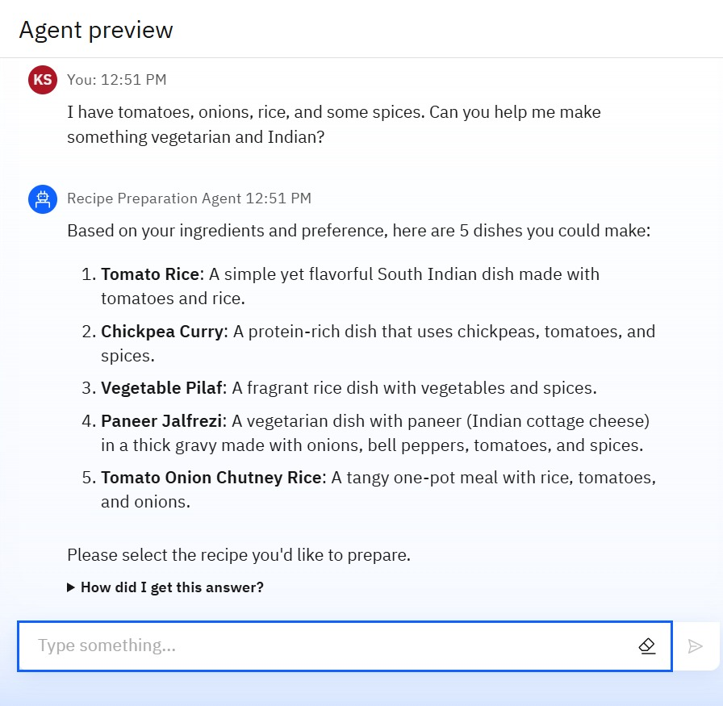
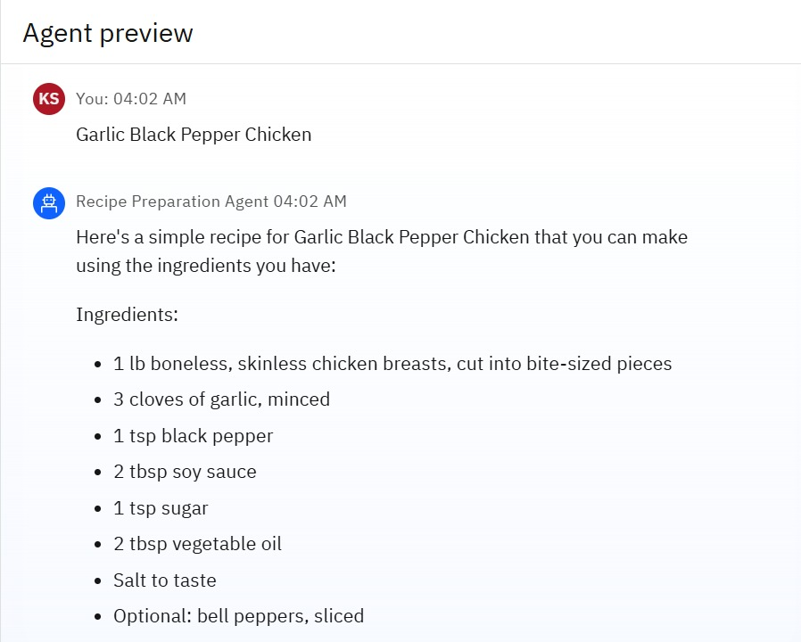
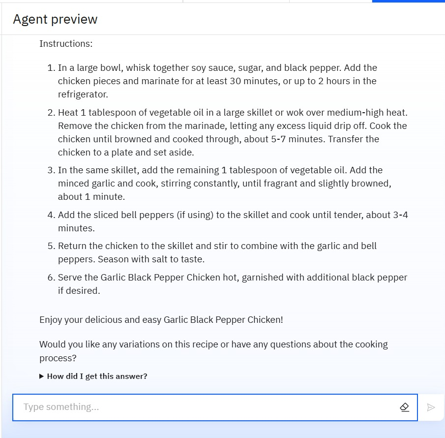
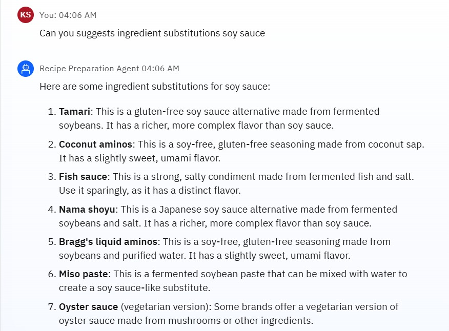
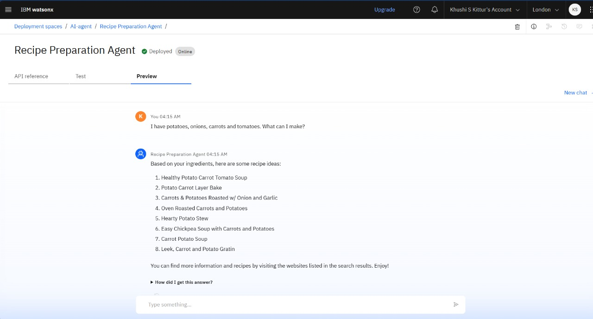

# 🍲 Recipe Preparation AI Agent

An AI-powered assistant designed to help users cook meals using only the ingredients they have on hand. Built using IBM Watsonx.ai and Retrieval-Augmented Generation (RAG), this smart cooking companion suggests tailored recipes, substitutes missing ingredients, and adapts to dietary preferences to make home cooking simple, sustainable, and efficient.

## 🧩 Problem Statement

Home cooks often struggle to decide what meals to prepare using the ingredients they currently have. Searching for suitable recipes online can be time-consuming and usually doesn't account for missing items or dietary needs. This leads to food waste, inefficient cooking, and stress during mealtime.

---

## 💡 Proposed Solution

An AI agent trained using IBM Watsonx.ai that leverages Retrieval-Augmented Generation (RAG) to provide customized recipe suggestions. It uses the user’s current grocery list to retrieve and adapt recipes, offers cooking tips, ingredient substitutions, and supports dietary adjustments—turning everyday ingredients into practical, delicious meals.

---

## 🧠 Technologies Used

- IBM cloud lite services
- Natural Language Processing (NLP)
- Retrieval Augmented Generation (RAG)
- IBM Granite model

---

## ☁️ IBM Cloud Services Used

- IBM Cloud Watsonx AI Studio
- IBM Cloud Watsonx AI runtime
- IBM Cloud Agent Lab
- IBM Granite foundation model  

---

## 👥 End Users

Home Cooks, Busy Professionals, Students, Families, People with Dietary Restrictions, Environmentally Conscious Consumers, Beginner Cooks

---

## 🌟 WOW Factors

- Tailored recipe suggestions based on available groceries  
- Step-by-step cooking instructions adapted to current ingredients  
- Ingredient substitution recommendations  
- Cooking tips for better results with limited ingredients  
- Dietary adjustments based on user preferences or restrictions  
- Retrieval-Augmented Generation (RAG)-based system for accurate and relevant recipe retrieval  

---

## 🧪 Key Features

- AI-generated recipe suggestions using available ingredients  
- Ingredient-aware step-by-step cooking instructions  
- Smart substitutions and dietary filters  
- Tips to optimize pantry use and reduce food waste  
- Built with Watsonx.ai and powered by IBM Granite LLM  
- Handles off-topic inputs with graceful redirection  

---

## 🚀 How It Works

1. User enters a list of available ingredients  
2. IBM Granite LLM processes the input  
3. Vector Index retrieves relevant recipes from uploaded dataset  
4. Agent adapts the recipe to fit available ingredients  
5. Final step-by-step recipe is delivered with substitutions and cooking tips  

---

## 🖼️ Screenshots
### 🔹 Input ingredients interface

### 🔹 Recipe suggestions based on input

### 🔹 Step-by-step instructions

### 🔹 Substitution tips

### 🔹 Deployment & Preview

## 📌 How to Run or Deploy

1. Log in to IBM Cloud Lite: https://cloud.ibm.com  
2. Launch Watsonx.ai Studio  
3. Create a new AI Agent project  
4. Upload your recipe dataset as documents into a Vector Index  
5. Configure system prompt and tool parameters  
6. Preview using ingredient inputs  
7. Deploy via web embed, API endpoint, or Streamlit interface  

---

## 🛣️ Future Scope

- Multilingual Recipe Support  
- Voice-Activated Cooking Assistant  
- Real-Time Ingredient Recognition via Image Input  
- Integration with Smart Kitchen Devices  
- Meal Planning and Grocery List Generation  
- Nutritional Analysis and Health Tracking  
- Personalized Recipe Recommendations Based on User History  

